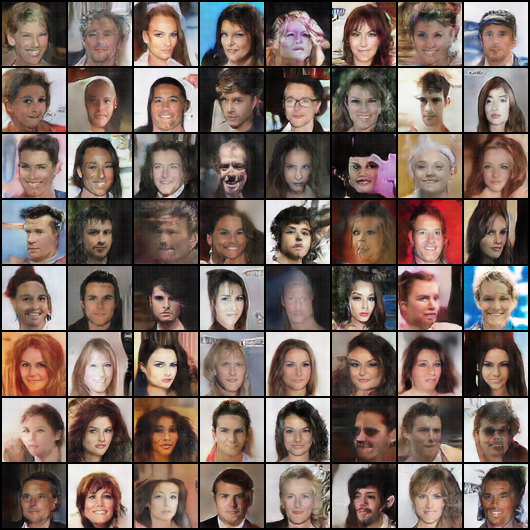
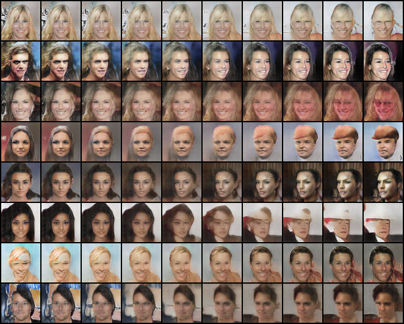

# DCGAN Face Generator

A Deep Convolutional Generative Adversarial Network (DCGAN) implementation. In this project, a generator and a discriminator compete against each other: the discriminator learns to distinguish between real images and fake images, while the generator learns to create increasingly realistic faces of people who do not exist to fool the discriminator.

## Reference
Radford, A., Metz, L., & Chintala, S. (2015). "Unsupervised Representation Learning with Deep Convolutional Generative Adversarial Networks" (arXiv 1511.06434).

## Results





### Summary Table

| Run Name | Change vs Baseline | Epochs | Sec/Epoch | Final LossD | Final LossG | FID |
|---|---|---|---|---|---|---|
| celeba_baseline | Baseline (25 epochs) | 25 | 137.5s | 0.080 | 4.005 | 29.85 |
| base_10ep | Baseline for comparison | 10 | 138.4s | 0.321 | 2.955 | 30.15 |
| exp_nobn | No BatchNorm | 10 | 129.6s | 0.884 | 0.747 | 44.20 |
| exp_lr5e-4 | High LR (5e-4) | 10 | 141.4s | 1.128 | 2.146 | 32.28 |
| exp_beta0.9 | Adam beta1=0.9 | 10 | 140.5s | 0.125 | 7.147 | 148.64 |
| ffhq_baseline | FFHQ dataset | 10 | 35.0s | 0.456 | 3.876 | 94.39 |
| exp_w128 | Wider networks (ngf=128, ndf=128, batch=64) | 10 | 452.5s | 0.182 | 5.291 | 23.95 |
| exp_bs64 | batch size 64, same width as baseline | 10 | 517.1s | 0.118 | 4.708 | 28.75 |

*Note: FID for ffhq_baseline is measured against FFHQ images and is not directly comparable to the CelebA runs.*

- FFHQ dataset contains 52,001 images.
- exp_w128 changed both the width and the batch size (64), so its gain over base_10ep cannot be credited to width alone; compare it with exp_bs64.
- Every result is a single run with one random seed, so small FID differences (a few points) may be noise.

## Quick Start (Demo)

You can run the demo using the included pre-trained weights.

1. Install the CUDA build of PyTorch from [pytorch.org](https://pytorch.org/).
2. Install the remaining requirements:
   ```bash
   pip install -r requirements.txt
   ```
3. Run the interactive web demo:
   ```bash
   python demo_app.py --ckpt weights/generator_celeba_dcgan.pt
   ```
4. Or generate a grid of faces from the command line:
   ```bash
   python generate.py --ckpt weights/generator_celeba_dcgan.pt --mode grid --out results/generated.png
   ```

## Train It Yourself

The datasets used for training are **NOT** included in this repository.

To download the datasets, you will need a Kaggle API token (`kaggle.json`). You can find the datasets here:
- [CelebA Dataset](https://www.kaggle.com/datasets/jessicali9530/celeba-dataset)
- [FFHQ Dataset](https://www.kaggle.com/datasets/arnaud58/flickrfaceshq-dataset-ffhq)

1. Download and prepare the dataset (e.g., CelebA):
   ```bash
   python prepare_data.py --dataset celeba
   ```
2. Train the baseline model:
   ```bash
   python train.py --run-name celeba_baseline --epochs 25
   ```

## Repository Structure

- `.gitignore`: Git exclusion file.
- `README.md`: This project documentation.
- `requirements.txt`: Python package dependencies.
- `check_gpu.py`: Utility to verify CUDA availability.
- `demo_app.py`: Interactive Gradio web interface for the generator.
- `fid_eval.py`: Script to calculate the Frechet Inception Distance (FID).
- `generate.py`: CLI tool for generating faces (grid or interpolation modes).
- `models.py`: PyTorch definitions for the DCGAN Generator and Discriminator.
- `prepare_data.py`: Script to download and preprocess datasets from Kaggle.
- `plot_results.py`: Utility for plotting loss curves and result comparisons.
- `train.py`: Main script to train the DCGAN model.
- `nn_check.py`: Nearest-neighbor check script.
- `run_experiments.sh` / `run_tasks.sh`: Shell scripts used for running batch experiments.
- `finish_up.py` / `wrap_up.py`: Utility scripts for final evaluations.
- `weights/`: Contains the exported lightweight generator weights (`generator_celeba_dcgan.pt`).
- `results/`: Contains generated images, comparison plots, and the summary table.
- `logs/`: Contains CSV files of training losses for the different experiments.

## Limitations

- The model only generates images at 64x64 resolution.
- Only a single seed was used per experiment.
- The model may occasionally generate distorted or artifacted faces.
- There is a noticeable celebrity-photo bias due to the nature of the training datasets.

## Notes

- **CelebA is for non-commercial research use only.**
- The weights provided were trained on the CelebA dataset; use them for research and education purposes only.
- All faces generated by this model are synthetic.
- **Security Note:** Only load `.pt` files from sources you trust.
